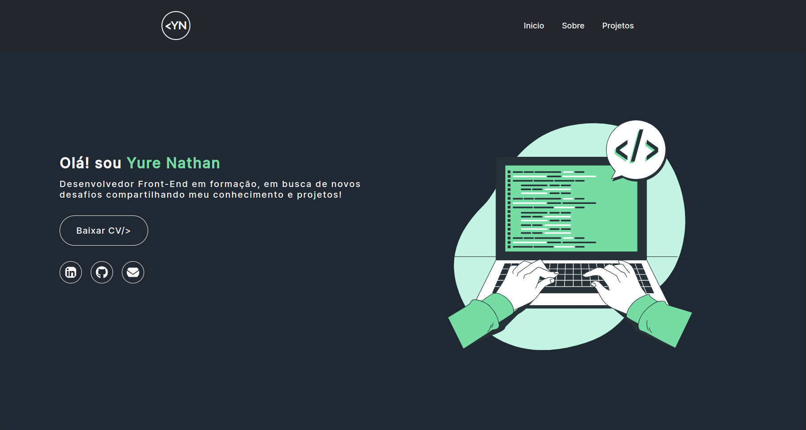

# Projeto portifólio 

Projeto final no curso vai na Web, um bom programador precisa de um portifolio para apresentar seus projetos, dessa forma foi criado o meu. foi aplicado os conehcimentos adquiridos nas aulas de React, utilizando styled components e rotas! 

## Tecnologias Utilizadas

- ReactJS
- React Router
- Styled Components

## Imagem do projeto finalizado

 
